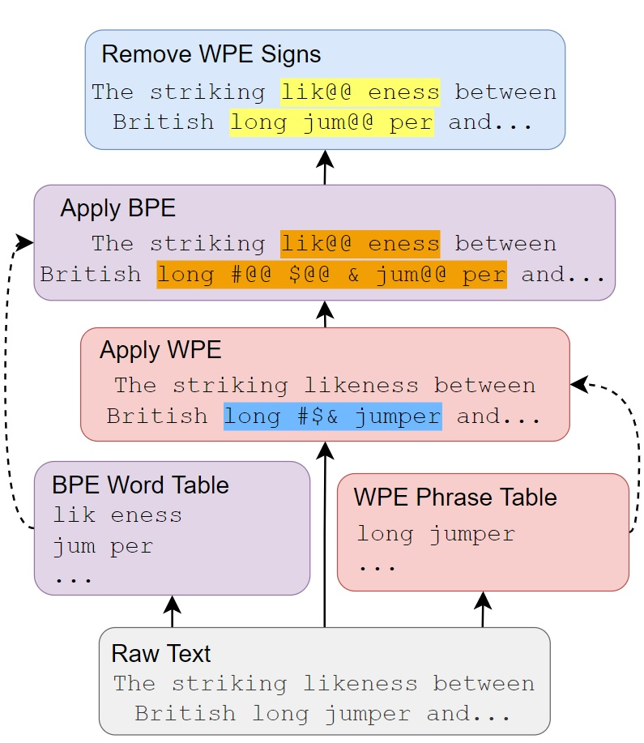

Word Pair Encoding (WPE)
=======

WPE is part of the methods proposed in EMNLP 2023 paper [**Enhancing Neural Machine Translation with Semantic Units**](https://arxiv.org/abs/2310.11360).

What can WPE do?
=======

WPE is used to extract semantic units (you may simply treat them as phrases), using statistical self-supervised method. 

Example:
* Input: Two sets of lights so close to one another : inten@@ tional or just a sil@@ ly error ?
* Semantic Units (Phrases): "close to", "one another", "inten@@ tional", "sil@@ ly"
* Output: [ [5,7], [7,9], [10,12], [15,16] ]

Explanation:
* The first two Semantic Units are phrases and the last two Semantic Units are "subword-level phrases".
* The output indicates the boundaries of Semantic Units.
* As shown above, WPE is orthogonal to Byte Pair Encoding (BPE)!

How dose WPE work?
=======

Below is an illustration of applying both WPE and BPE. For more details, please refer to the [paper](https://arxiv.org/abs/2310.11360).



Requirements
=======

* In this project, `subword-nmt` is used to implement the BPE operation. Please make sure you have installed `subword-nmt` ([https://github.com/rsennrich/subword-nmt](https://github.com/rsennrich/subword-nmt)) on your system.

* In this project, texts are tokenized with `mosesdecoder` ([https://github.com/moses-smt/mosesdecoder](https://github.com/moses-smt/mosesdecoder)). However, this is recommended but not a must and WPE should work on texts without tokenization, with relatively worse performance though.

# How to use WPE?
Let's assume the very begining data are called "train.raw.src", "valid.raw.src"(optional), "test.raw.src"(optional)

Process should be done before WPE:

1. Tokenize "train.raw.src". The output file is named "train.tok.src".
2. Learn BPE on "train.tok.src" (using [`subword-nmt`](https://github.com/rsennrich/subword-nmt)). The output is "bpe.code" and "vocab.src"(optional)

Implement WPE:

3. Fill in `GetPhraseSpans.sh` with files obtained through step 1 and 2. 
4. Run `bash GetPhraseSpans.sh`.

# Citing

```
@inproceedings{
huang2023enhancing,
title={Enhancing Neural Machine Translation with Semantic Units},
author={Huang, Langlin and Gu, Shuhao and Zhang, Zhuocheng and Feng, Yang
},
booktitle={Proceedings of the 2023 Conference on Empirical Methods in Natural Language Processing},
year={2023},
}
```